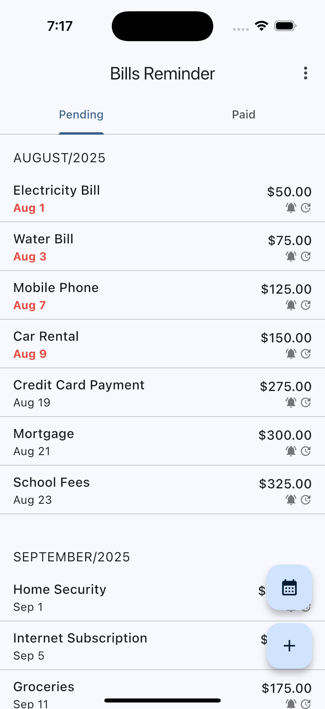
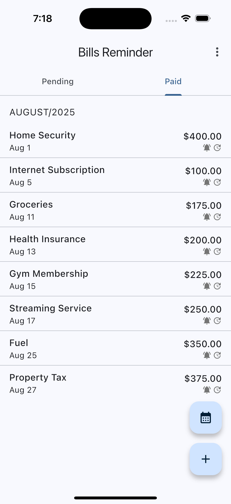
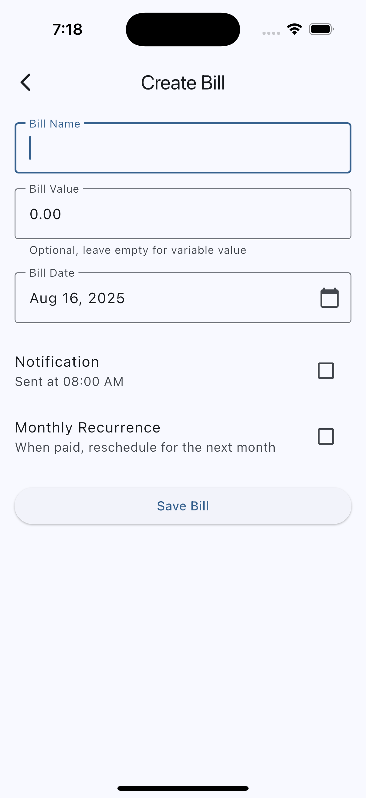
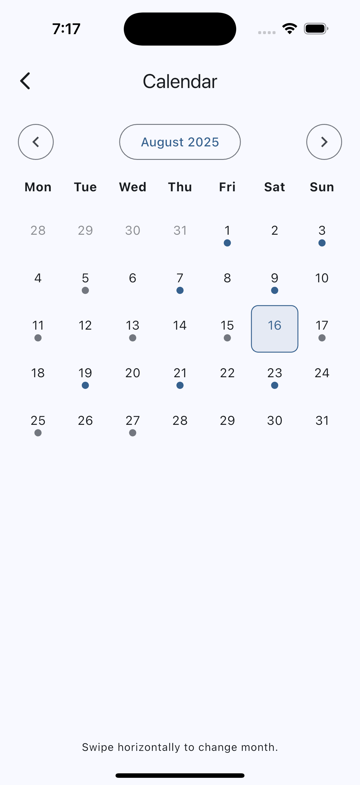
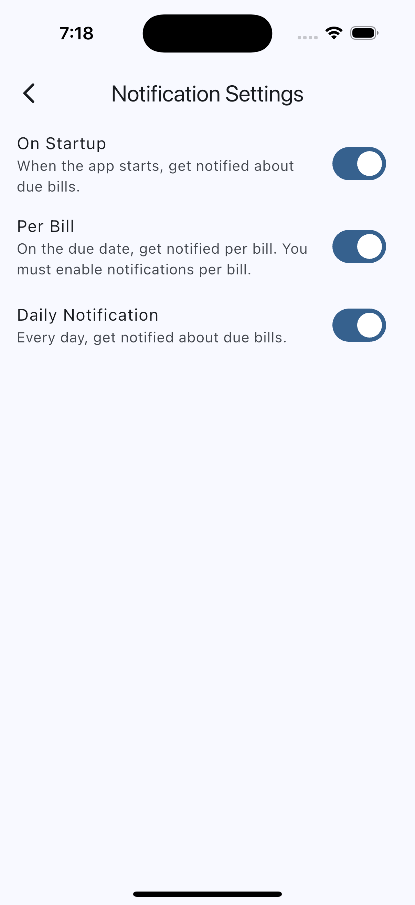

# Bills Reminder App

A Flutter application that helps you track and manage your bills with smart notifications and reminders.

## Overview

Bills Reminder is a personal finance tool designed to help you never miss a bill payment again. The app provides an intuitive interface for managing bills, setting up notifications, and tracking payment status with a clean, Material Design 3 interface.

### Key Features

- 📅 **Bill Management**: Create, edit, and organize bills with due dates and amounts
- 🔔 **Smart Notifications**: Multiple notification types (startup, daily, per-bill reminders)
- 📊 **Visual Organization**: Separate views for pending and paid bills
- 🗓️ **Calendar View**: Monthly calendar showing bills by date
- 🔄 **Recurring Bills**: Support for monthly recurring bills
- 💾 **Local Storage**: All data stored securely on your device
- 🌙 **System Theme**: Automatic light/dark theme support
### Screenshots

Pending bills:



Paid bills:



Create bill:



Calendar view:



Notification settings:



## Architecture

The app follows clean architecture principles with three distinct layers:

- **UI Layer**: Flutter widgets and view models for presentation
- **Domain Layer**: Business logic and entity models
- **Data Layer**: Local storage, notifications, and background services

## Getting Started

### Prerequisites

- Flutter SDK 3.8.1 or higher
- Dart SDK
- Android Studio / VS Code with Flutter extensions

### Installation

1. Clone the repository:
   ```bash
   git clone https://github.com/gostosinho-labs/bills-reminder-app.git
   cd bills-reminder-app
   ```

2. Install dependencies:
   ```bash
   flutter pub get
   ```

3. Run the app:
   ```bash
   flutter run
   ```

## Features Documentation

For detailed information about all app features and functionality, see [docs/features.md](docs/features.md).

## Tech Stack

- **Flutter**: Cross-platform UI framework
- **SQLite**: Local database storage
- **Provider**: State management and dependency injection
- **Go Router**: Declarative navigation
- **Flutter Local Notifications**: Push notifications
- **WorkManager**: Background task scheduling
- **Material Design 3**: Modern UI components

## Development

### Project Structure

```
lib/
├── main.dart                 # App entry point
├── data/                     # Data layer (repositories, services)
├── domain/                   # Business logic and models
├── ui/                       # User interface screens and widgets
├── routing/                  # Navigation configuration
└── dependencies/             # Dependency injection setup
```

### Contributing

This is a personal project, but contributions are welcome! Please:

1. Follow the existing architecture patterns
2. Maintain separation of concerns between layers
3. Add appropriate tests for new features
4. Follow Flutter best practices

## Privacy

- All data is stored locally on your device
- No personal information is transmitted externally
- No analytics or tracking implemented

## License

This project is available under the MIT License. See the LICENSE file for more details.
