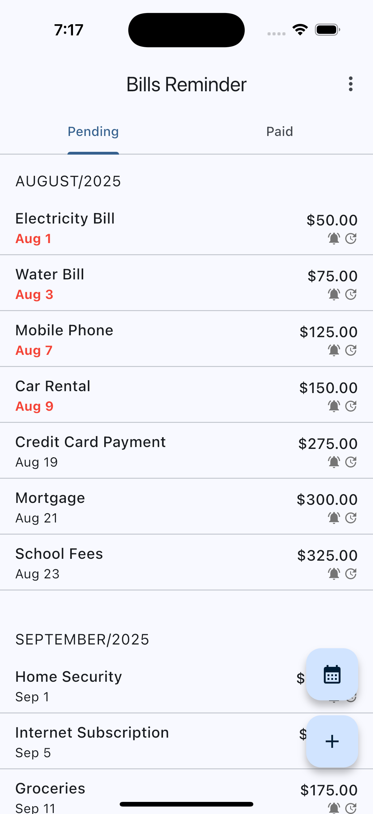
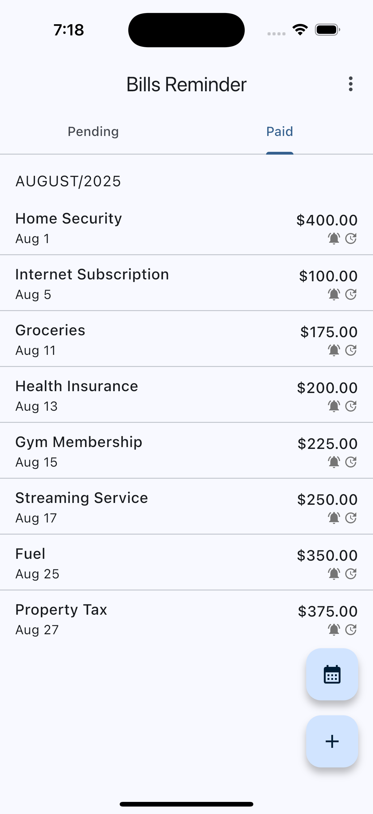
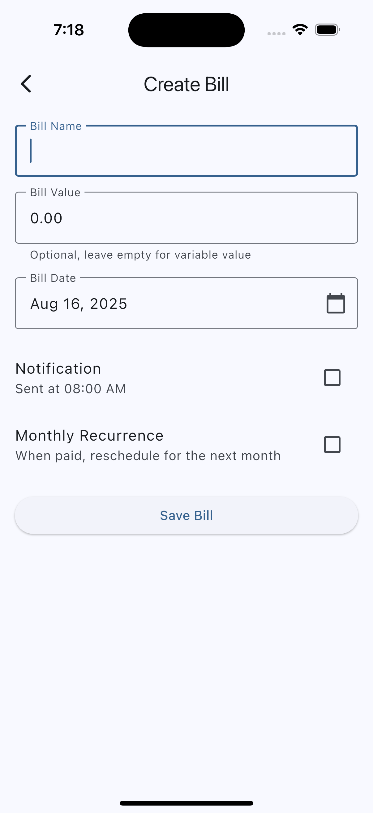
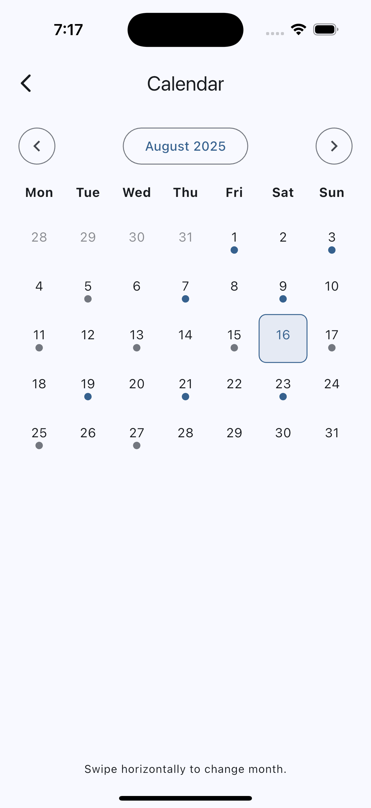
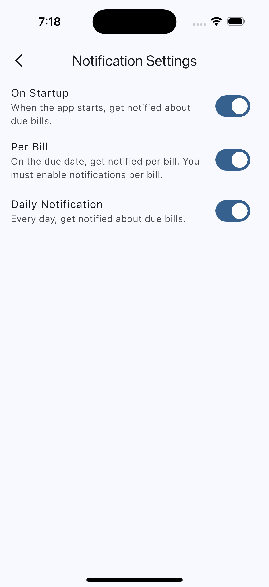

# Bills Reminder App

A Flutter app for tracking bills, due dates, and payment status on your device.

## Features

- Create, edit, and delete bills with an optional amount.
- Separate pending bills from paid bills.
- View bills in a monthly calendar.
- Schedule a local notification for a bill's due date.
- Show overdue-bill notifications at startup or during periodic background work.
- Create the next monthly occurrence when you pay a recurring bill.
- Follow the device's light or dark theme.

All bills and settings stay in local app storage. The app has no account,
cloud sync, analytics, or network data sharing.

## Screenshots

Pending bills:



Paid bills:



Create bill:



Calendar view:



Notification settings:



## Getting Started

### Prerequisites

- Stable Flutter SDK with Dart 3.8.1 or a later Dart 3 release
- An Android or iOS development environment

### Run the App

1. Clone the repository:

   ```bash
   git clone https://github.com/gostosinho-labs/bills-reminder-app.git
   cd bills-reminder-app
   ```

2. Install dependencies:

   ```bash
   flutter pub get
   ```

3. Run the app:

   ```bash
   flutter run
   ```

The app requests notification permissions during startup. Notification timing
depends on the device's operating system and background-work rules.

## Privacy

- SQLite stores bills on the device without database encryption.
- SharedPreferences stores notification settings on the device.
- The app has no backend, cloud sync, analytics, or tracking SDK.

## Documentation

- [Features and known limitations](docs/FEATURES.md)
- [User workflows](docs/WORKFLOWS.md)
- [Architecture](docs/ARCHITECTURE.md)
- [Development environment](docs/ENVIRONMENT.md)
- [Verification](docs/VERIFICATION.md)

## Technology

- Flutter and Material Design 3
- SQLite and SharedPreferences
- Provider and GoRouter
- Flutter Local Notifications and WorkManager

The code uses separate UI, domain, and data layers. See the
[architecture guide](docs/ARCHITECTURE.md) before changing the app.
